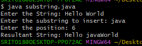
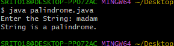
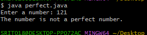

##EXPERIMENT-1 
#SOURCECODE :
```
import java.util.Scanner;
class subString {
  public static void main(String[] args) {
    String mainStr,subStr,result;
    int position;
    Scanner sc = new Scanner(System.in);
    System.out.print("Enter the String: ");
    mainStr = sc.nextLine();
    System.out.print("Enter the substring to insert: ");
    subStr = sc.nextLine();
    System.out.print("Enter the position: ");
    position = sc.nextInt();
    result = mainStr.substring(0,position)
              +subStr
              +mainStr.substring(position);
    System.out.print("Resultant String: " +result);
    }
  }

```
#OUTPUT:

#EXPERIMENT-3
#SOURCECODE:
```
import java.util.Scanner;
class Palindrome {
    public static void main(String[] args) {
        String str;
        Scanner sc = new Scanner(System.in);
        System.out.print("Enter the String: ");
        str = sc.nextLine();
        int start = 0;
        int end = str.length() - 1;
        boolean flag = true;
        while (start < end) {
            if (str.charAt(start) != str.charAt(end)) {
                System.out.println("String is not a palindrome.");
                flag = false;
                break;
            }
            start++;
            end--;
        }
        if(flag) {
            System.out.println("String is a palindrome.");
        }
        sc.close();
    }
}
```
#OUTPUT:


#EXPERIMENT-4
#SOURCECODE:
```
import java.util.Scanner;
class perfect {
    public static void main(String args[]) {
        int num, sum = 0;
        Scanner sc = new Scanner(System.in);
        System.out.print("Enter a number: ");
        num = sc.nextInt();
        for (int i = 1; i <= num / 2; i++) {
            if (num % i == 0) {
                sum = sum + i;
            }
        }
        if(sum==num) {
            System.out.println("The number is a perfect number.");
        } else {
            System.out.println("The number is not a perfect number.");
        }
        sc.close();
    }
}

```
#OUTPUT:

