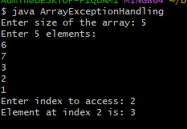
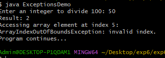
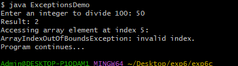

##EXPERIMENT-6
#6a)
```
#SOURCE CODE:
import java.util.Scanner;
public class ArrayExceptionHandling {
    public static void main(String[] args) {
        Scanner sc = new Scanner(System.in);
        System.out.print("Enter size of the array: ");
        int n = sc.nextInt();
        int[] arr = new int[n];
        System.out.println("Enter " + n + " elements:");
        for (int i = 0; i < n; i++) {
            arr[i] = sc.nextInt();
        }
 System.out.print("Enter index to access: ");
        int index = sc.nextInt();
        try {
            System.out.println("Element at index " + index + " is: " + arr[index]);
        }
        catch (ArrayIndexOutOfBoundsException e) {
            System.out.println("Invalid index! Please enter index between 0 and " + (n - 1));
        }
      sc.close();
    }
}
```
#OUTPUT:



#6b)
#SOURCE CODE:
```
import java.util.Scanner;
public class ExceptionsDemo {
    public static void main(String[] args) {
        Scanner sc = new Scanner(System.in);
        try {
            System.out.print("Enter an integer to divide 100: ");
            int n = sc.nextInt();
            int result = 100 / n;
 System.out.println("Result: " + result);
            int[] arr = new int[3];
            System.out.println("Accessing array element at index 5:");
            System.out.println(arr[5]);
            System.out.print("Enter a number as text: ");
            sc.nextLine();
            String s = sc.nextLine();
            int num = Integer.parseInt(s);
            System.out.println("Converted number: " + num);
        }
        catch (ArithmeticException e) {
            System.out.println("ArithmeticException: division by zero.");
        }
        catch (ArrayIndexOutOfBoundsException e) {
            System.out.println("ArrayIndexOutOfBoundsException: invalid index.");
        }
        catch (NumberFormatException e) {
            System.out.println("NumberFormatException: invalid numeric format.");
        }
        catch (Exception e) {
            System.out.println("Some other exception occurred.");
        }
        System.out.println("Program continues...");
        sc.close();
    }
}
```
#OUTPUT:



#6c)
#SOURCE CODE:
```
import java.util.Scanner;
public class ExceptionsDemo {
    public static void main(String[] args) {
        Scanner sc = new Scanner(System.in);
        try {
            System.out.print("Enter an integer to divide 100: ");
            int n = sc.nextInt();
            int result = 100 / n;
            System.out.println("Result: " + result);
         System.out.println("Result: " + result);
            int[] arr = new int[3];
            System.out.println("Accessing array element at index 5:");
            System.out.println(arr[5]);
            System.out.print("Enter a number as text: ");
            sc.nextLine();
            String s = sc.nextLine();
            int num = Integer.parseInt(s);
            System.out.println("Converted number: " + num);
        }
        catch (ArithmeticException e) {
            System.out.println("ArithmeticException: division by zero.");
        }
        catch (ArrayIndexOutOfBoundsException e) {
            System.out.println("ArrayIndexOutOfBoundsException: invalid index.");
        }
  catch (NumberFormatException e) {
            System.out.println("NumberFormatException: invalid numeric format.");
        }
        catch (Exception e) {
            System.out.println("Some other exception occurred.");
        }
        System.out.println("Program continues...");
        sc.close();
    }
}
```
#OUTPUT:

