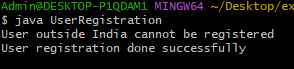
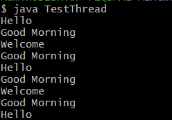
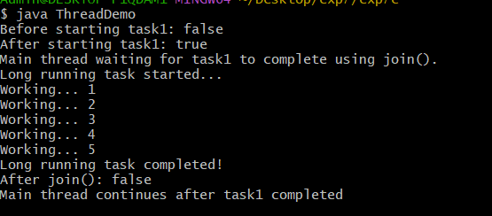

##EXPERIMENT-7
#7a)
#SOURCE CODE:
```
InvalidCountryException.class :
public class InvalidCountryException extends Exception {
    public InvalidCountryException() {
        super();
    }
    public InvalidCountryException(String message) {
        super(message);
    }
}
UserRegistration.class
public class UserRegistration {
    void registerUser(String userName, String userCountry) throws InvalidCountryException {
        if (!userCountry.equalsIgnoreCase("India")) {
            throw new InvalidCountryException("User outside India cannot be registered");
        } else {
            System.out.println("User registration done successfully");
        }
    }
    public static void main(String[] args) {
        UserRegistration ur = new UserRegistration();
        try {
            ur.registerUser("Ravi", "USA");
        } catch (InvalidCountryException e) {
            System.out.println(e.getMessage());
        }
  try {
            ur.registerUser("Anita", "India");
        } catch (InvalidCountryException e) {
            System.out.println(e.getMessage());
        }
    }
}
```
#OUTPUT:

#7b)
#SOURCE CODE:
```
GoodMorningThread.class :
public class GoodMorningThread extends Thread {
    public void run() {
        try {
            while (true) {
                System.out.println("Good Morning");
                Thread.sleep(1000);
            }
        } catch (InterruptedException e) {
            System.out.println(e);
        }
    }
}
 HelloThread.class :
public class HelloThread extends Thread {
    public void run() {
        try {
            while (true) {
                System.out.println("Hello");
                Thread.sleep(2000);
            }
        } catch (InterruptedException e) {
            System.out.println(e);
        }
    }
}
TestThread.class
public class TestThread {
    public static void main(String[] args) {
        GoodMorningThread t1 = new GoodMorningThread();
        HelloThread t2 = new HelloThread();
        WelcomeThread t3 = new WelcomeThread();
        t1.start();
        t2.start();
        t3.start();
    }
}
WelcomeThread.class :
public class WelcomeThread extends Thread {
    public void run() {
        try {
            while (true) {
                System.out.println("Welcome");
                Thread.sleep(3000);
            }
        } catch (InterruptedException e) {
            System.out.println(e);
        }
    }
}
```
#OUTPUT :


#7c)
#SOURCE CODE:
```
Thread.class :
class LongRunningTask extends Thread {
    @Override
    public void run() {
        System.out.println("Long running task started...");
        try {
            for (int i = 1; i <= 5; i++) {
                System.out.println("Working... " + i);
                Thread.sleep(1000);
            }
        } catch (InterruptedException e) {
            System.out.println("Task interrupted: " + e);
        }
        System.out.println("Long running task completed!");
      }
}
ThreadDemo.class
public class ThreadDemo {
    public static void main(String[] args) {
        LongRunningTask task1 = new LongRunningTask();
        System.out.println("Before starting task1: " + task1.isAlive());
        task1.start();
        System.out.println("After starting task1: " + task1.isAlive());
        System.out.println("Main thread waiting for task1 to complete using join().");
        try {
            task1.join();
        } catch (InterruptedException e) {
            System.out.println("Main thread interrupted: " + e);
        }
        System.out.println("After join(): " + task1.isAlive());
        System.out.println("Main thread continues after task1 completed");
    }
}
```
#OUTPUT :

