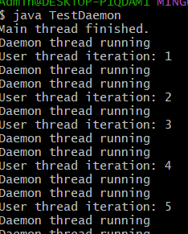

##EXPERIMENT-8
#8a)
#SOURCE CODE:
```
UserThread.class :
class UserThread extends Thread {
    @Override
    public void run() {
        try {
            for (int i = 1; i <= 5; i++) {
                System.out.println("User thread iteration: " + i);
                Thread.sleep(1000);
            }
        } catch (InterruptedException e) {
            System.out.println("User thread interrupted");
        }
    }
}
 TestDaemon.class:
public class TestDaemon {
    public static void main(String[] args) {
        UserThread userThread = new UserThread();
        DaemonThread daemonThread = new DaemonThread();
        daemonThread.setDaemon(true);
        userThread.start();
        daemonThread.start();
        System.out.println("Main thread finished.");
    }
}
```
#OUTPUT:

